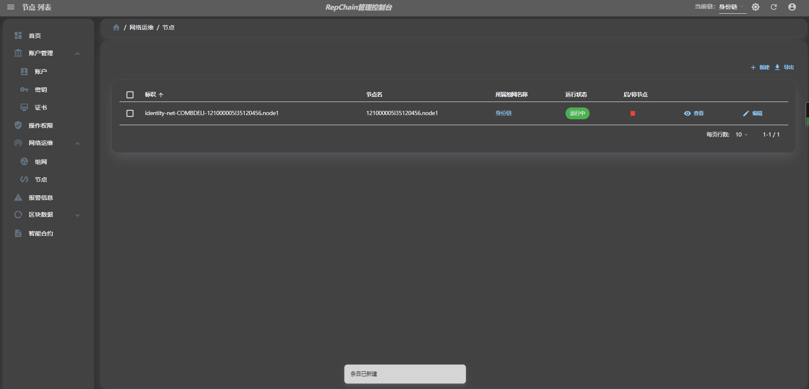
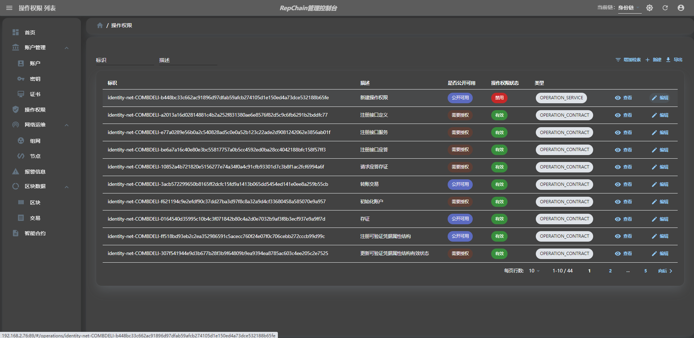

# RepChain Dashboard 2.0 用户手册
RepChain Dashboard，即RepChain区块链管理控制台，主要为RepChain联盟链平台的管理运维人员提供联盟链身份管理、联盟链网络管理以及区块链信息浏览（即区块链浏览器）等功能。

其中，联盟链身份管理包括：

- 本地密钥/证书管理
- 账户管理
- 账户证书管理 
- 权限管理

联盟链网络管理包括：

- 联盟链网络实时状态监控
- 联盟链节点管理　
- 报警信息管理

可验证凭据包括：

- 可验证凭据结构
- 可验证凭据状态

构造交易包括：

- 部署合约
- 调用合约
- 更改合约有效性

区块链信息浏览包括：

- 区块数据浏览
- 交易数据浏览
- 智能合约数据浏览
- 信息统计

## 登录
与基于账户密码的传统登录方式不同，在本应用中，管理人员需要使用RepChain区块链管理员账户及密钥来进行登录，若浏览器中无对应的管理员密钥对，则需要先导入密钥对。区块链管理员账户及其密钥是联盟链在组建时已经通过配置初始化好的，因此，需要从RepChain已经配置好的管理员密钥文件（如节点程序目录下的jks/\*admin\*.jks）中导出密钥对，然后再将其导入到浏览器中，之后即可使用管理员身份登录本应用。

如下所示，可以借助工具[KeyStore Explorer](https://keystore-explorer.org/)打开区块链管理员密钥文件，并导出PEＭ格式的管理员密钥对信息(已包含其公钥证书)：

### 将上述密钥对信息导入到浏览器中

将上述密钥对导入到浏览器中，如下所示：

在登录界面，点击链接按钮"浏览器中还没有相应密钥对"，跳转到密钥新建界面。在密钥新建界面，选择"导入已有"新建方式，点击或将密钥对文件拖拽到"密钥对文件"输入区，在"私钥加密密码"及"私钥加密密码确认"输入框中输入自定义密码，在"名称"输入框中输入对该密钥对的自定义名称，最后点击"创建"按钮。创建成功，则跳转到密钥列表界面。点击顶部的登录按钮可跳转到登录界面。

!!! note

    若浏览器中已存在该管理员的密钥对信息，则登录时可省略上述导入过程。

### 在已导入密钥对的基础上登录

在登录界面，在"账户标识"输入框中输入管理员账户的唯一标识（联盟链初始化时已确定），在"账户证书名"输入框中输入与导入的密钥对对应的账户证书名称（联盟链初始化时已确定，并非是导入密钥对时自定义的密钥对名称），并在"密码"输入框中输入在密钥导入过程中所输入的私钥加密密码（即这里输入密码的目的是对浏览器中的管理员私钥进行解密使用，在登录过程中，实际上是依靠密钥签名及验签来验证身份），最后点击"登录"按钮，登录成功后，将跳转到首页。

如下所示：

## 配置
在本应用中，需配置浏览器欲连接的RepChain区块链节点URL以及身份链标识。该URL指向了RepChain身份链上的某个节点，身份链标识应设置为"identity-net"，与RepChain身份链上的标识保持一致。本应用中的若干功能操作需要在身份链上生成区块链交易，并向该节点提交交易，此外，在显示身份链的区块链网络实时状态图信息时也需要与该节点交互。因此，在正常使用相应功能之前，需要配置好RepChain节点URL和身份链标识。如下所示：

进入应用首页，点击顶部应用栏右侧的"设置"按钮，然后在弹出的菜单中选择"配置"菜单项，进入配置页面，在该页面的"欲连接的RepChain节点Url"输入框中输入相应节点的URL（如："http://192.168.2.76:9081"），在该页面的"身份链标识"输入框中输入"identity-net"，最后点击"保存"按钮即可完成配置。
## 组网管理
RepChain V2.0支持多链协同功能，可以实现不同类别的业务数据相对隔离，并通过建立新的业务链实现扩容。多链协同则允许在不同的链之间订阅和实时同步状态，并依据跨链状态执行链内合约逻辑，实现同构链之间的分工合作。

### 身份链管理

首先，点击"新建"按钮添加身份链标识"identity-net"（需要向管理员确认该标识，与RepChain中部署信息一致），进入网络列表界面，可查看网络标识、名称、已知区块数、后台已同步区块数、区块链节点数量以及数据同步状态信息，新建链在添加节点后可开启同步，同步状态下也可以点击"停止同步"以停止数据同步状态。点击"查看"按钮，进入详情界面，选择"组网节点"选项卡，可查看区块链网络中的节点状态；选择"组网状态"选项卡，可查看区块链网络的实时状态信息，包括节点状态、交易提交以及共识出块情况。点击"编辑"按钮，可以修改当前链名称。如下所示：

### 业务链管理

点击"新建"按钮添加业务链标识"credence-net"（需要向管理员确认该标识，与RepChain中部署信息一致），与前述身份链不同的是，需要点击页面右上角的"当前链"切换为"业务链"方可进行其余操作。如下所示：

## 节点管理

### 新建节点

管理员可在节点列表界面点击"新建"按钮，进入节点创建界面，输入节点标识（需与联盟链中的节点程序标识一致）、节点名称、节点管控服务url（与节点程序在相同服务器上），Rest/Websocket API url为节点所在地址，最后点击"保存"按钮来添加已经部署在节点服务器上的区块链节点。

!!! note

    这里的新建节点操作，实际上是添加已部署好的区块链节点信息，以方便对其进行管理，不同于在区块链网络中动态增加节点。

### 删除节点
若要删除节点，可在节点列表界面选中要删除的节点，并点击"删除"按钮。

!!! note

    这里的删除节点操作，实际上是删除已添加的区块链节点信息，不同于在区块链网络中动态删除节点。

### 启/停节点
在节点列表界面，可点击相应节点的"运行"或"停止"按钮，以对节点进行启动和停止操作，并能根据节点状态信息实时监控各个节点的运行状态。

## 首页概览
在完成组网信息配置并开启数据状态同步后，访问首页，可快速查看统计信息，包括本地浏览器中的密钥对数量、区块链网络系统中的账户数量、区块链网络系统中的账户证书数量、区块链网络系统中的节点数量、区块链网络报警数量、现有区块数量以及现有交易数量。

在统计图部分，可以对区块数及交易数分别进行统计。可通过"时间范围"及"时间粒度"选择框统计不同时间范围和粒度的区块/交易产生情况，还可从"显示图"选择框中选择对统计结果使用不同的图形进行显示（如面积图、柱状图或折线图）。此外，针对交易数据统计，还可通过"分类统计"选择按钮，对交易进行分类统计，以分别显示"部署合约交易"、"调用合约交易"及"更改合约状态交易"等不同类别的交易数量统计情况。如下所示：

此外可查看区块链网络系统中智能合约被调用量的百分比统计情况，账户交易提交量排行统计情况。如下所示：

页面左侧菜单栏，即是本应用所具有的各项功能的入口。点击代表具体功能入口的相应菜单项，可跳转到相应功能的列表页面。

## 本地密钥/证书管理
用户的非对称密钥及对应数字证书（即公钥证书）信息被存储在本地浏览器中(即存储于浏览器的indexedDB数据库中，且可对其私钥进行加密保护)，由使用者自行掌控。

用户可管理本地浏览器中的非对称密钥以及数字证书，包括生成、导入/导出密钥对，以及签发、导入/导出证书等。

### 导入已有密钥对
在密钥列表界面点击"新建"按钮，进入密钥对新建界面；然后选择"导入已有"的新建方式，在"密钥对文件"选择区域选择本地文件系统中已保存的密钥对文件，若该密钥对文件中的私钥未被加密，则还需要在"私钥加密密码"和"私钥加密密码确认"输入框中输入自定义密码以对私钥进行加密保护；然后，在"名称"输入框中输入自定义密钥对名称；点击"新建"按钮，即可将已有密钥导入到浏览器中。如下所示：

### 导入已有证书
一个数字证书是与某个非对称密钥的公钥绑定的，可表示该公钥的数字身份，而该非对称密钥可被视为该数字证书的拥有者。同时数字证书又是被某个非对称密钥的私钥所签发的，该非对称密钥可被视为该数字证书的签发者。若已有对应密钥所拥有的数字证书文件(符合X.509标准的PEM格式)，则可以将其导入到浏览器中。如下所示：

在密钥列表界面选择将要被导入证书的密钥，点击"显示"按钮，进入密钥详细信息显示界面；选择"拥有的证书"选项卡，点击"新建"按钮；选择"导入已有证书"方式，选择本地文件系统中的已有证书文件，最后点击"创建"按钮，即可将已有证书导入到浏览器中。

!!! note 

    在进行导入已有密钥对的操作时，若密钥对文件中已包含相应的数字证书，则会自动导入该数字证书，不用在此手动导入。

### 生成新密钥对
需要生成全新的非对称密钥时，在密钥列表界面点击"新建"按钮，进入密钥对新建界面；选择"新生成"的新建方式，选择算法名(EC或者RSA，推荐使用EC)，选择算法参数(如使用椭圆曲线算法EC时，选择secp256k1曲线)，然后在"私钥加密密码"和"私钥加密密码确认"输入框中输入自定义保护密码，在"名称"输入框中输入自定义密钥对名称，最后点击"创建"按钮，将在浏览器中生成全新的非对称密钥。如下所示：

### 签发证书
管理员可生成自签名证书，或使用其证书及密钥根据其他人或机构提交的CSR(证书签名请求)来签发证书。

**自签名证书**:
若需要生成自签名证书，则可在密钥列表界面选择需要生成自签名证书的密钥，点击"显示"按钮，进入该密钥详细信息显示界面；点击"拥有的证书"选项卡，点击"新建"按钮；选择"生成自签名证书"，输入证书序列号(建议使用默认值)，输入证书拥有者信息(符合X.500标准的唯一名称Distinguished Names，如/O=iscas/OU=sdr/CN=admin)，选择证书签名算法(如SHA256withECDSA)，选择证书有效期(在默认值下证书将不会过期)，输入私钥保护密码，最后点击"创建"按钮，即可创建自签名证书。如下所示：

**签发证书**:
若需要生成有层级关系的证书，证书请求者首先得生成CSR(证书签名请求)信息，然后将CSR提交给管理员（证书颁发机构CA）来进行审核签发相应证书。

管理员收到了相应CSR文件，则可根据该CSR信息签发证书： 在密钥列表界面，选择要用来签发相应证书的密钥，点击"显示"按钮；然后点击"已签发证书"，点击"新建"按钮以进入签发证书界面；选择本地文件系统中的CSR文件，选择证书签名算法，选择CA证书，填写私钥密码，最后点击"创建"按钮，即可签发数字证书，该数字证书可被用于后续注册区块链账户证书，也可被导出为证书文件以返回给请求方。如下所示：

## 账户管理
管理员可对RepChain区块链中的账户进行管理，包括注册新账户、禁用及启用账户。

账户是表示用户身份的实体，而账户证书是账户用以发起各种操作的凭证，每个账户可以拥有多个账户证书。账户证书分为两类：

- 身份验证证书：可管理普通证书

- 普通证书：用于其它一般操作

每个账户可以拥有若干身份验证证书和若干普通证书，该账户模型如下所示：

在注册账户时，会初始化该账户的身份验证证书，因此，在注册新账户时，需要提供至少一个身份验证证书。

### 注册账户
注册新账户时，在账户列表界面点击"新建"按钮，进入账户注册界面；在表单中输入社会信用代码、账户名称等信息，点击"账户身份证书"下的"增加"按钮，在新出现的"证书名称"输入框中输入自定义证书名称，在"选择证书"选择框中选择待作为该账户身份验证证书的本地证书（若要继续添加身份验证证书，则可以继续点击"增加"按钮，并继续上述操作步骤）；然后点击"注册"按钮，将会弹出填写操作者信息的对话框，填写其私钥的解密密码，最后点击"确认"按钮。将会构建签名交易并提交到区块链网络以注册账户，等待提交成功后跳转到账户列表界面，刷新列表界面后能发现已成功注册了该账户。如下所示：

### 禁用账户
需要注销某个账户时，可以对其进行禁用操作。在账户列表界面选择要禁用的账户，点击"编辑"按钮，进入账户信息编辑界面；在"账户状态"选择框中选择"禁用"，然后点击"保存"按钮，将会弹出填写操作者信息的对话框，填写其私钥的解密密码，最后点击"确认"按钮。将会构建签名交易并提交到区块链网络以禁用账户，等待提交成功后跳转到账户信息显示界面，刷新界面后能发现已成功禁用了该账户。如下所示：

### 启用账户
若在禁用某个账户之后，又想要重新启用该账户，可以对其进行启用操作。在账户列表界面选择处于禁用状态的待启用账户，点击"编辑"按钮，进入账户信息编辑界面；在"账户状态"选择框中选择"有效"，然后点击"保存"按钮，将会弹出填写操作者信息的对话框，填写其私钥的解密密码，最后点击"确认"按钮。将会构建签名交易并提交到区块链网络以启用账户，等待提交成功后跳转到账户信息显示界面，刷新界面后能发现已成功启用了该账户。如下所示：

## 账户证书管理
账户证书是被某个区块链账户所拥有并被注册到区块链网络中的实体，需要与存储于本地浏览器的本地证书区别开（本地证书是与本地密钥相关联的数字证书），但它们也具有这样的联系：注册账户证书前需要在浏览器中创建本地证书，在注册账户证书时需提供相应的本地证书信息。

### 注册账户证书
本应用提供了两种操作方法来注册账户证书:

1. 通过账户详情显示界面
2. 直接通过账户证书新建界面

对于方法1，首先在账户列表界面，选择要添加注册账户证书的账户，点击"显示"按钮，进入账户详情显示界面；点击"账户证书"选项卡，再点击"新增证书"按钮，进入证书新建界面；此时"所属账户"输入框已经有了默认值，不需要再编辑，选择要注册的本地证书，填写自定义证书名称，选择证书类型"身份验证证书"或"普通证书"，点击"注册"按钮；在弹出的"填写操作者信息"对话框中，填写其私钥的解密密码，最后点击"确认"按钮，待提交交易出块后即可看到新注册的账户证书。如下所示：

对于方法2，首先在账户证书界面，点击"新建"按钮，进入账户证书新建界面；选择所属账户为要添加注册账户证书的目标账户，之后的操作与方法1的是一致的，不再赘述。如下所示：

### 禁用账户证书
注销/禁用账户证书同样有两种方法：

1. 通过账户显示界面
2. 直接通过账户证书编辑界面

对于方法1，首先在账户列表界面，选择要被禁用账户证书的账户，点击"查看"按钮，进入账户详情显示界面；点击"账户证书"选项卡，再选择要注销禁用的账户证书，点击"编辑"按钮；进入证书账户编辑界面，将"账户证书状态"置为"禁用"，再点击"保存"按钮；在弹出的对话框中，填写私钥解密密码，最后点击"确认"按钮，待提交交易出块后即可看到相应账户证书状态为禁用。如下所示：

方法2的操作与方法1的类似，只是需要直接在账户证书列表选择待被禁用的账户证书，进入编辑界面进行操作。之后的操作与方法1的是一致的，不再赘述。如下所示：

### 启用账户证书
禁用账户证书后，仍然可以再次启用该账户证书，有两种操作方法：

1.通过账户详情显示界面
2.直接通过账户证书编辑界面

对于方法1，首先在账户列表界面，选择要被启用账户证书的账户，点击"查看"按钮，进入账户详情显示界面；点击"账户证书"选项卡，再选择处于禁用状态的待启用账户证书，点击"编辑"按钮；进入证书账户编辑界面，将"账户证书状态"置为"有效"，再点击"保存"按钮；在弹出的对话框中，填写私钥解密密码，最后点击"确认"按钮。即可启用相应账户证书。如下所示：

方法2的操作与方法1的类似，只是需要直接在账户证书列表选择处于禁用状态的待启用账户证书，进入账户证书编辑界面进行操作。与方法1的操作是一致的，不再赘述。如下所示：

## 权限管理
管理员可以向RepChain区块链网络注册操作权限、禁用操作权限或启用操作权限，此外还可向其他账户授予操作权限或撤销授权。

### 注册操作权限
操作权限即是指对相应操作的执行权限，这里的操作可被分为两类：合约方法调用和系统服务调用，其中合约方法是指被部署于RepChain区块链网络中的智能合约的合约方法，系统服务主要是指RepChain区块链节点程序提供的API服务，如提交交易API，获取区块数据API等。因此，操作权限也表示对某个智能合约的合约方法或系统API的调用权限。 

管理员可以针对具体合约方法或系统服务向RepChain区块链注册操作权限，当系统中的账户想执行相应操作时，区块链系统会检查该账户是否拥有对应的操作权限。

注册操作权限，首先在操作权限列表界面，点击"新建"按钮，进入操作权限注册新建界面；在"描述"输入框中输入操作权限的描述信息（如说明本操作权限的用途），在"是否公开可用"处选择"公开"或"非公开"(公开意味着其他账户无需授权即可执行该操作，否则需要被授予该权限才能执行该操作)，选择该操作权限的类型(合约方法或系统服务，默认为合约方法，"合约方法"表示该操作是通过区块链交易去调用某个智能合约方法，"系统服务"表示该操作是直接调用RepChain节点服务提供的某个API)，若操作类型为"合约方法"，则还需要填写合约方法的完整名称(类似network_id:contract.function，其中，network_id为组网标识，contract为合约名称，function为方法名称，**注意：即使选择类型为"合约方法"，"服务名称"输入框中也需要输入表示提交交易的服务API名称，默认值为"transaction.postTranStream")**；若操作类型为"系统服务"，则在"服务名称"输入框中输入具体的服务名称以覆盖默认值；然后点击"创建"按钮；在弹出的对话框中填写私钥解密密码，最后点击"确认"按钮。如下所示：

### 禁用操作权限
管理员可禁用某个操作权限，账户即使被授予了该操作权限，也无法执行相应操作。对某个操作权限进行注销/禁用，首先进入操作权限列表界面，选择需要禁用的操作权限，点击其"编辑"按钮，进入编辑界面；点击"操作权限状态"选择框，选择"禁用"，然后点击"保存"按钮；在弹出的对话框中填写私钥解密密码，最后点击"确认"按钮。如下所示：

### 启用操作权限
在禁用某个操作权限后，也还可以再次启用它。首先进入操作权限列表界面，选择处于禁用状态的待启用操作权限，点击其"编辑"按钮，进入编辑界面；点击"操作权限状态"选择框，选择"有效"，然后点击"保存"按钮；在弹出的对话框中填写私钥解密密码，最后点击"确认"按钮。如下所示：

### 授予权限
管理员可以将操作权限授予其他账户。首先点击顶部应用栏右侧的"设置"图标按钮，在弹出的菜单中选择"我的账户"菜单项，进入管理员账户详情显示界面；或者管理员可在账户列表界面点击"查看"按钮，选择"操作权限"选项卡，点击"授予权限"按钮，进入授权界面；点击"被授权者"下的"增加"按钮，填写或选择"被授权者账户标识"，继续点击"增加"按钮可选择多个被授权者账户，然后点击"操作权限"选择框，选择要授予出去的操作权限（可多选），在"让渡方式"选择框选择是否让渡授予这些权限的权限（即被授权者是否可以将这些权限再次授予给其他账户），然后点击"授予权限"按钮；在弹出的对话框中，填写对应私钥解密密码，最后点击"确认"按钮，待提交交易出块后即可看到新增的授权情况。如下所示:
 

### 绑定证书
被授权账户可在账户列表页面点击"查看"按钮，进入操作权限界面，查看被授权情况，包括标识、让渡类型和授予状态等信息；点击"绑定证书"按钮，选择账户证书，在弹出的对话框中填写被授权账户对应的操作者账户、操作者账户证书、签名密钥以及私钥保护密码，最后点击"确认"按钮，待提交交易出块后即可看到被授权账户的操作权限界面中的绑定证书信息。如下所示：

### 撤销授权
管理员可撤销其对其他账户的授权，类似授予操作权限的流程，首先进入管理员的账户详情显示界面，点击"操作权限"选项卡，然后在"授权情况"列表中选择要撤销的授权，点击"撤销授权"按钮，进入撤销授权界面；点击"撤销授权"按钮；在弹出的对话框中填写私钥解密密码，最后点击"确认"按钮。如下所示：

## 报警信息管理
本应用可对区块链系统进实时报警信息监控及处理。当发生报警时，界面会收到报警通知；进入报警信息列表界面，可查看发生的报警信息，包括其类型、级别、具体报警描述及是否已被处理等信息；对于未被处理的抱紧信息，可点击"处理"按钮，进入报警处理界面，可输入报警处理过程描述信息，最后点击"保存"按钮以完成处理。如下所示：

## 构造交易
本应用可构造交易并提交至区块链系统，实现部署合约、调用合约以及更改合约有效性，在交易列表界面，点击"新建"按钮，进入构造交易界面，交易类型可以选择CHAINCODE_DEPLOY(部署合约)、CHAINCODE_INVOKE(调用合约)以及CHAINCODE_SET_STATE(更改合约有效性)。

###  部署合约
部署合约时选择交易类型为CHAINCODE_DEPLOY(部署合约)，需要填写"智能合约名"，选择"智能合约版本"，合约代码可以选择"输入文本"或者"输入文件"，填写"合约规则法律描述"，根据合约语言选择"合约类型"，选择"合约串/并行类型"，选择"合约状态存在性证明类型"，然后点击"保存"按钮；在弹出的对话框中填写私钥解密密码，最后点击"确认"按钮，待提交交易出块后即可在交易列表看到部署合约的交易信息和执行情况。如下所示：

### 调用合约
调用合约时选择交易类型为CHAINCODE_INVOKE(调用合约)，需要填写"智能合约名"，选择"智能合约版本"，填写要调用的"合约方法"，填写"合约方法参数"，然后点击"保存"按钮；在弹出的对话框中填写私钥解密密码，最后点击"确认"按钮，待提交交易出块后即可看到调用合约的交易信息和执行情况。如下所示：

### 更改合约有效性
更改合约有效性时选择交易类型为CHAINCODE_SET_STATE(更改合约有效性)，需要填写"智能合约名"，选择"智能合约版本"，修改"有效状态"为"启用"或者"禁用"，然后点击"保存"按钮；在弹出的对话框中填写私钥解密密码，最后点击"确认"按钮，待提交交易出块后即可看到更改合约有效性的交易信息和执行情况。如下所示：

## 可验证凭据
本应用可由凭据属性结构创建者向区块链系统注册可验证凭据属性结构，凭据验证方作为可验证凭据验证者，可对接收到的可验证凭据出示信息及其包含的可验证凭据进行验证。

可验证凭据(VerifiableCredential，VC)提供了一种以数字化方式来表示及使用凭据的方案，在方便凭据的保存、传输及验证的同时，还为使用者提供了保护其隐私信息的能力。

关于RepChain可验证凭据的具体信息及使用方式请参考以下链接

- [RepChain可验证凭据技术方案](https://gitee.com/BTAJL/repchain-did-and-vc-specifications/blob/master/verifiable-credential-based-on-blockchain-and-atomicity-signature-specification.md)
- [RepChain可验证凭据Java SDK](https://gitee.com/BTAJL/repchain-vc-java-sdk) 
- [RepChain可验证凭据REST Service](https://gitee.com/BTAJL/repchain-vc-rest-service) 

### 可验证凭据结构
本应用可由凭据属性结构创建者向区块链系统注册可验证凭据属性结构，在可验证凭据结构界面，点击"新建"按钮，添加"可验证凭据结构描述"，然后点击"保存"按钮；在弹出的对话框中填写私钥解密密码，最后点击"确认"按钮，待提交交易出块后即可看到可验证凭据结构注册的信息，如标识、版本、名称及状态等。如下所示：

在可验证凭据结构列表界面，还可对可验证凭据结构信息进行分页、排序及过滤检索；针对具体凭据结构，点击"查看"按钮，进入凭证结构详情界面，可查看特定凭证结构的详细信息，包括描述、创建者、创建时间及凭证属性表等。还可以更改可验证凭据结构的有效状态，点击"编辑"按钮，将状态置为"禁用"，再点击"保存"按钮；在弹出的对话框中，填写私钥解密密码，最后点击"确认"按钮，即可禁用该凭据结构，禁用后还可以通过相同操作启用。如下所示：

### 可验证凭据状态
本应用可对区块链系统中的可验证凭据状态进行查询，在可验证凭据列表界面，可根据标识和状态对凭据信息进行分页、排序及过滤检索；针对具体凭证，点击"查看"按钮，还可查看凭据签发者和无效属性编号。如下所示：

## 区块链浏览器
### 区块数据浏览
本应用可对区块链系统中的区块数据进行检索浏览，在区块列表界面，可对区块信息进行分页、排序及过滤检索；针对具体区块，点击"查看"按钮，进入区块详情界面，可查看特定区块的详细信息，包括区块哈希、出块时间、区块高度、出块者、背书信息及包含交易信息。如下所示：

### 交易数据浏览
本应用可对区块链系统中的交易数据进行检索浏览，在交易列表界面，可对交易信息进行分页、排序及过滤检索；针对具体交易，点击"查看"按钮，进入交易详情界面，可查看特定交易的详细信息，包括交易唯一标识、交易签名、交易签名者、所属区块哈希及关联智能合约等信息。如下所示：

### 智能合约数据浏览
本应用可对区块链系统中的智能合约数据进行检索浏览，在智能合约列表界面，可对智能合约进行分页、排序及过滤检索；针对具体智能合约，点击"查看"按钮，进入智能合约详情界面，可查看其详细信息，包括合约名称、版本、有效性状态、合约类型（CONTRACT_CUSTOM表示为用户自行部署的合约，CONTRACT_SYSTEM表示为RepChain的系统内置合约）、合约部署者以及合约源码等信息，点击"相关交易"选项卡可以查看与该智能合约相关的交易，点击"合约存储KV"选项卡可以查看Key-Value数据信息。如下所示：

在智能合约列表界面，点击"新建"按钮，可构造交易部署合约、调用合约以及更改合约有效性。如下所示：

